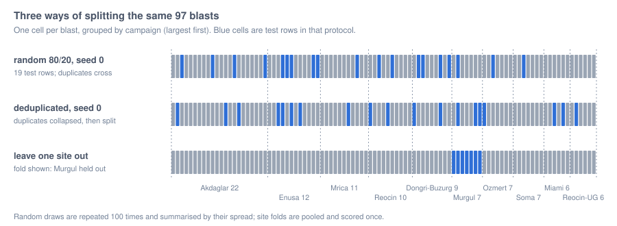

# The protocol-sensitivity benchmark

The result this package exists to produce: the same arms on the same rows, scored under three ways of
splitting them, with the spread of every random protocol, the uncertainty of every site-held-out
score, and the provenance of every arm reported beside the number.



---

## 1. Why the protocol is the experiment

Sui et al. 2025 (`doi:10.3390/app15031254`) report a variance explained of 0.943 for a stacking
ensemble from one random 80/20 split of these 97 blasts. Seventeen of the 97 rows duplicate another
row's feature vector, so a random draw places duplicates on both sides of the split by construction.
The same paper writes, while describing how the stacked model was built, that "the first attempt was
to use cross-validation ... but the cross-validated model had a poor prediction effect on the test
set ... thus canceling the cross-validation".

Rows within one campaign share a rock mass, a drilling rig, an explosive supply and, in this corpus, a
measurement method chosen by the researchers who ran that campaign (image analysis with Wipfrag at the
two Istanbul quarries, image analysis at Soma, and methods the source does not restate for the other
sites). A model can therefore score well on a random split by recognising the campaign rather than by
modelling the blast. Roberts et al. 2017 (`doi:10.1111/ecog.02881`) set out why data with this kind of
group structure needs a split that holds out whole groups, and Kapoor and Narayanan 2023
(`doi:10.1016/j.patter.2023.100804`) catalogue how leakage between training and test rows inflates
reported performance across applied machine learning.

| Protocol | Rule | Question it answers |
|---|---|---|
| `random-8020` | seeded random 80/20, repeated over seeds 0 to 99 | how does the published protocol behave, draw to draw? |
| `dedup-random` | duplicate feature vectors collapsed to one row (mean measured size), then random 80/20, repeated | how much of the random-split score is the duplicates? |
| `leave-one-site-out` | each of the ten campaigns held out once, folds pooled | can a model reach a mine it has not seen? |

## 2. What is computed

**Variance explained about the identity line.** For measured sizes $y_i$ and predictions $\hat y_i$
over the scored rows,

$$
R^2_{\mathrm{id}} \;=\; 1 - \frac{\sum_i (y_i - \hat y_i)^2}{\sum_i (y_i - \bar y)^2},
$$

which is negative when the predictions are worse than the mean of the scored rows. It is not the
squared correlation $r^2$, which the source papers report as "R2" and which ignores bias and scale.
Both are carried on every score; only $R^2_{\mathrm{id}}$ is quoted as "variance explained".

**Repeated protocols.** Each of the $K = 100$ draws is scored on its own test rows; the protocol is
summarised by the median and the 5th and 95th percentiles of $R^2_{\mathrm{id},k}$. Draws are never
pooled, because a row lands in several test sets.

**Leave-one-site-out, pooled.** Every blast is predicted once, by an arm fitted on the other nine
sites, and the pooled predictions are scored together. Averaging per-fold scores instead would weight
the six-blast sites like the 22-blast quarry.

**Two supports.** Every pooled score is reported over all 97 blasts and over the 91 whose pattern
geometry is resolvable. The classical arms can only answer on the second set, so comparing a classical
score with a learned one over the first set compares different denominators.

**Common support (0.4.0).** Each arm's abstentions are dropped from its own score, so even the
`geometry` set leaves arms scored on different rows where an arm refuses a prediction outside the
plausible range. Every score is therefore also reported on the rows that every size-predicting arm
answered (the router, which predicts a group, is left out): per draw for the random protocols, once
for the pooled held-out predictions, with its site interval. This is a row set reported beside the two
declared ones; the criterion is not re-evaluated on it, because it was not declared before the run.

**Site-resampled intervals.** The ten sites are resampled with replacement 2000 times and the pooled
score recomputed (a cluster bootstrap, Field and Welsh 2007, `doi:10.1111/j.1467-9868.2007.00593.x`;
the bootstrap itself, Efron 1979, `doi:10.1214/aos/1176344552`). The 2.5th and 97.5th percentiles
are the reported interval. Resampling blasts instead would treat 22 rows from one quarry as 22
independent observations.

## 3. The kill criterion, declared before the run

> The learned tier counts as generalising across sites only if the best learned arm's variance
> explained under leave-one-site-out is **both positive and at least 0.10 above the null model's**.

The second half was added after the first run, which produced a best learned arm at -0.034 against a
null at -0.216 and, under the margin-only rule, declared success. The sentence has not changed since,
and a test pins its hash. 0.3.0 changed what is reported beside it: the criterion is now evaluated on
both supports, and an outcome that differs between them is reported as depending on the row set.

## 4. The result

Variance explained about the identity line. Abstentions in brackets. Intervals are site-resampled 95
percent intervals. Measured with numpy 2.5.3, scikit-learn 1.9.0 and xgboost 3.4.1.

| Arm | random, median (5th to 95th) | deduplicated, median | site held out, all 97 | interval | site held out, 91 with geometry | interval |
|---|---|---|---|---|---|---|
| null, predict the training mean | -0.036 (-0.40 to -0.00) | -0.049 | -0.216 | -1.28 to -0.15 | -0.232 | -1.33 to -0.16 |
| oracle, return the measurement | 1.000 (1.00 to 1.00) | 1.000 | 1.000 | 1.00 to 1.00 | 1.000 | 1.00 to 1.00 |
| classical mean size, site factor | 0.303 (-0.59 to 0.74) | 0.310 | 0.311 (6) | -0.96 to 0.70 | 0.311 | -0.97 to 0.69 |
| classical mean size, transfer factor | 0.312 (-0.57 to 0.69) | 0.331 | 0.298 (6) | -1.10 to 0.72 | 0.298 | -1.10 to 0.71 |
| classical mean size, site factor, capped at the in-situ block (declared) | 0.399 (-0.49 to 0.75) | 0.360 | 0.352 (6) | -0.95 to 0.74 | 0.352 | -0.96 to 0.73 |
| group router | abstains | abstains | abstains | - | abstains | - |
| published regression (in sample) | 0.805 (0.65 to 0.93) | 0.837 | 0.802 | 0.57 to 0.90 | 0.781 | 0.50 to 0.88 |
| refitted regression | 0.686 (0.39 to 0.87) | 0.715 | -4.075 (4) | -19.48 to 0.02 | -4.601 | -21.92 to 0.09 |
| published network | 0.362 (-0.65 to 0.70) | 0.183 | -0.626 | -3.35 to 0.01 | -0.604 | -3.42 to 0.09 |
| support vector, radial | 0.665 (0.22 to 0.81) | 0.651 | -0.387 (1) | -1.61 to -0.06 | -0.466 | -1.86 to -0.07 |
| support vector, polynomial | 0.395 (0.09 to 0.66) | 0.396 | -4.546 (11) | -16.24 to -0.83 | -4.811 | -17.18 to -0.95 |
| random forest | 0.749 (0.55 to 0.90) | 0.753 | -0.231 | -2.78 to 0.38 | -0.233 | -2.88 to 0.40 |
| gradient boosting | 0.704 (0.48 to 0.85) | 0.702 | -0.034 | -2.23 to 0.42 | 0.034 | -1.78 to 0.53 |
| stacking ensemble | 0.703 (0.47 to 0.85) | 0.699 | -0.035 | -2.25 to 0.42 | 0.034 | -1.81 to 0.54 |

The verdict the package writes: the outcome **depends on the row set**. Over all 97 blasts the best
learned arm, gradient boosting, is at -0.034 and the criterion is not met. Over the 91 with resolvable
geometry, the stacked model is at 0.034, 0.266 above the null, and the criterion is met. The six blasts
that separate the two are the Miami campaign, which has the smallest fragments in the corpus (mean
0.080 m against 0.304 m) and is where the tree models fail hardest.

### 4.1 On the rows every arm answers

Held out by site the common rows are **79 blasts from nine sites**. They drop the six Miami blasts
(no geometry for the classical arms) and twelve more that a fitted arm refused because its prediction
left the plausible range: eight by the polynomial kernel (four at Akdaglar, three at Reocin-UG, one at
Dongri-Buzurg; it also refuses three of the Miami blasts) and four by the refitted regression, all at
Murgul. The radial kernel's one refusal, Ad3, is among the polynomial kernel's. The random draws keep a
median of 17 of about 19 test rows.

| Arm | random, median on common rows | site held out, on the 79 common rows | interval |
|---|---|---|---|
| null | -0.041 | -0.229 | -1.49 to -0.16 |
| classical mean size, site factor | 0.320 | 0.318 | -0.93 to 0.67 |
| classical mean size, transfer factor | 0.293 | 0.293 | -1.11 to 0.69 |
| classical mean size, capped (declared) | 0.419 | 0.364 | -0.93 to 0.72 |
| published regression (in sample) | 0.773 | 0.766 | 0.45 to 0.87 |
| refitted regression | 0.671 | -3.715 | -22.09 to 0.10 |
| published network | 0.329 | -0.491 | -2.85 to 0.13 |
| support vector, radial | 0.656 | -0.329 | -1.68 to 0.01 |
| support vector, polynomial | 0.344 | -4.837 | -17.69 to -1.05 |
| random forest | 0.741 | -0.167 | -2.92 to 0.46 |
| gradient boosting | 0.693 | 0.212 | -0.65 to 0.48 |
| stacking ensemble | 0.691 | 0.215 | -0.66 to 0.49 |

**Read these with their selection in mind.** The common rows are chosen by the arms' own refusals,
and an arm refuses where it extrapolates, so the rows it drops are the hard ones. That is why the tree
models rise from -0.034 over every blast to 0.21 here. It is also why the criterion is not evaluated on
this set: a row set picked by which models failed, after the run, would be the post hoc choice the
declared criterion exists to prevent. Even here no arm outside the in-sample regression has an interval
above zero.

## 5. What the table supports

### 5.1 The learned arms lose most of their score when whole sites are held out

Against the median of 100 random draws, the drop to the site-held-out score is 0.74 for gradient
boosting and the stacked model, 0.98 for the random forest, 0.99 for the network, 1.05 for the radial
support-vector arm and 4.94 for the polynomial one; the median over the six learned arms is 0.98.
This is the robust finding: it holds on both supports and for every learned arm.

### 5.2 The published 0.943 is a favourable draw of its own protocol

Reproducing the published stacking construction and drawing its protocol 100 times gives a median of
0.703 and a 95th percentile of 0.845; no draw reaches 0.943. Its single published split sits in the
upper tail before any question of leakage arises.

### 5.3 Deduplication does not explain the gap

Collapsing the duplicated feature vectors moves the median of the forest, the boosting arm, the
stacked model and both support-vector arms by at most 0.015. The network's median moves by -0.18,
within its own draw-to-draw spread of -0.65 to 0.70. The difference between the random and the
site-held-out score is the site, not the duplicates.

### 5.4 The classical equation scores the same under every protocol

A fixed-coefficient arm predicts the same value for a blast whichever protocol is running, so only
the scored rows change: 0.303 at the median random draw, 0.310 deduplicated, 0.311 held out by site.
Releases before 0.3.0 reported a single draw at -0.027 and described the arm as "improving" under the
site hold-out; that was the draw, not the arm.

### 5.5 The classical result does not borrow the held-out site's rock factor

The classical arm reads a per-site rock factor back-solved from the published predictions for that
site's own hold-out blasts (see [the rock factor](03_rock-factor.md)). Under leave-one-site-out that
is information about the held-out site. The transfer arm ([07](07_transfer.md)) predicts the factor
from Young's modulus with a line fitted over the training sites only and scores 0.298 against 0.311.

### 5.6 What ten sites cannot separate

Apart from the published regression, which is in sample, no arm's site-resampled interval clears
zero on either support. The classical arm's 0.311 and the boosting arm's 0.034 are point estimates
from ten sites, and their intervals overlap almost entirely. "The classical equation transfers and
the learned arms do not" is a reading of point estimates, and this package does not print it as a
finding.

### 5.7 The null's margin is inflated under this protocol

Holding out a coarse site lowers the training mean, so the null predicts low exactly where the
measurements are high. Its pooled predictions correlate with the measurements at $r = -0.79$. A margin
over this null is larger than the skill it seems to measure, which is why the positivity half of the
criterion carries the weight.

## 6. Per site

Root mean square error on each held-out site, metres. A site where an arm's error exceeds the null's is
a site the arm did not reach.

| Arm | Akdaglar | Dongri-Buzurg | Enusa | Miami | Mrica | Murgul | Ozmert | Reocin | Reocin-UG | Soma |
|---|---|---|---|---|---|---|---|---|---|---|
| null, predict the training mean | 0.172 | 0.193 | 0.140 | 0.239 | 0.155 | 0.061 | 0.136 | 0.387 | 0.317 | 0.094 |
| classical mean size, site factor | 0.054 | 0.330 | 0.147 | - | 0.111 | 0.052 | 0.061 | 0.216 | 0.093 | 0.132 |
| classical mean size, transfer factor | 0.057 | 0.290 | 0.175 | - | 0.213 | 0.110 | 0.061 | 0.166 | 0.086 | 0.076 |
| published regression (in sample) | 0.040 | 0.160 | 0.091 | 0.011 | 0.034 | 0.022 | 0.063 | 0.152 | 0.064 | 0.036 |
| random forest | 0.097 | 0.284 | 0.110 | 0.256 | 0.346 | 0.263 | 0.059 | 0.285 | 0.087 | 0.078 |
| gradient boosting | 0.088 | 0.225 | 0.114 | 0.300 | 0.100 | 0.365 | 0.089 | 0.314 | 0.080 | 0.106 |
| stacking ensemble | 0.088 | 0.224 | 0.114 | 0.301 | 0.092 | 0.367 | 0.090 | 0.314 | 0.081 | 0.107 |
| published network | 0.143 | 0.216 | 0.352 | 0.314 | 0.124 | 0.332 | 0.080 | 0.367 | 0.203 | 0.044 |
| mean measured | 0.171 | 0.413 | 0.396 | 0.080 | 0.166 | 0.311 | 0.191 | 0.616 | 0.593 | 0.224 |

Two sites dominate the learned arms' failure: Murgul (the boosting arm's error is six times the null's)
and Miami (the smallest fragments in the corpus). The two Reocin campaigns, with the coarsest
fragments, defeat every arm that is not in sample, because no training site is as coarse.

## 7. The stacked model behaves like its boosting learner

Built as published, with the meta-learner fitted on the base learners' in-sample predictions, the
linear weights on the full corpus are 1.02 on the boosting learner and -0.02 on the forest. The
boosting learner fits its training rows almost exactly, so a meta-learner trained on those rows trusts
it almost entirely. Releases before 0.3.0 used scikit-learn's out-of-fold stacking with two folds, a
different method, and reported -0.951 for this arm held out by site; built as published it is -0.035.

## 8. Reproducing it

```python
import blastfrag as bf

result = bf.run_benchmark(bf.load_training_corpus(), bf.default_arms(), n_repeats=100, n_boot=2000)
print(result.verdict["outcome"])
for row in result.table():
    print(row)
```

About two and a half minutes on a desktop CPU, almost all of it the network's Levenberg-Marquardt
training. The result carries the digest of the dataset it ran on, so a number and the rows behind it
cannot drift apart.
